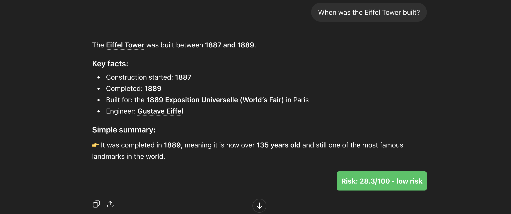

# LLM Hallucination Detector

Chrome extension + Flask backend that detects hallucinations in ChatGPT and Claude responses.

**Author:** Sree Nikitha Reddy Doddareddy (002414150)
**GitHub:** https://github.com/SreeNikithaReddyD/LLM-HALLUCINATIONS

---

## Setup

**1. Clone and enter the project:**
```bash
git clone https://github.com/SreeNikithaReddyD/LLM-HALLUCINATIONS.git
cd LLM-HALLUCINATIONS
```

**2. Create virtual environment and install dependencies:**
```bash
python -m venv venv
source venv/bin/activate        # Mac/Linux
venv\Scripts\activate           # Windows

pip install -r requirements.txt
python -m spacy download en_core_web_sm
```

**3. Add your Hugging Face API key:**

Get a free token at https://huggingface.co/settings/tokens, then create a `.env` file in the project root:
```
HUGGINGFACE_API_KEY=hf_your_token_here
```

---

## Running

**Start the Flask server:**
```bash
python backend/server.py
```
Server runs on `http://localhost:5001`. Keep this open the whole time.

**Load the Chrome extension:**
1. Go to `chrome://extensions`
2. Enable **Developer mode**
3. Click **Load unpacked** → select the `chrome-extension/` folder
4. The extension icon will appear in your toolbar

---

## Testing

**Option 1 — Test modules directly (no server needed):**
```bash
python direct_test.py
```

**Option 2 — Test the API endpoint (server must be running):**
```bash
python test_api.py
```

**Option 3 — Full system:**
1. Start the server
2. Go to https://chatgpt.com or https://claude.ai
3. Ask any question
4. Wait 5-10 seconds — a colored badge appears on the response
   - 🟢 Green = low risk (0-29)
   - 🟡 Yellow = medium risk (30-59)
   - 🔴 Red = high risk (60+)

Example output : 

## Troubleshooting

| Problem | Fix |
|---|---|
| spaCy won't install | Use Python 3.10 or 3.11 |
| Hugging Face API error | Check `.env` file has a valid token |
| Badge not showing | Make sure server is running on port 5001; check browser console for errors |
| Server won't start | Make sure virtualenv is activated first |